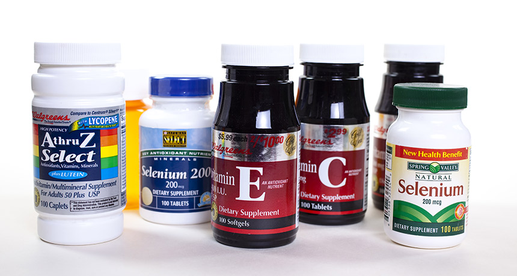

```{r setup, include=FALSE}
knitr::opts_chunk$set(echo = FALSE)
```


## Source of the article

Nicoletta Lanese. « Antioxidants may encourage the spread of lung cancer rather than prevent it ». Science News. June 27, 2019. <https://www.sciencenews.org/article/antioxidants-lung-cancer-spread-prevent>

Word count : 668

## Vocabulary

I used https://www.wordreference.com/, https://en.wiktionary.org/ and https://dictionary.cambridge.org to fill in this table.

| Vocabulary                    | Pronunciation       | Definition / synonym                                                                                               | French translation         |
| ----------------------------- | ------------------- | ------------------------------------------------------------------------------------------------------------------ | -------------------------- |
| mechanism                     | [ˈmɛkənɪzəm]        | the way something works                                                                                            | mécanisme                  |
| metastasis                    | [mɪˈtæstəsɪs]       | the spread of cancer                                                                                               | métastase                  |
| to thwart                     | [ˈθwɔːrt]           | stop sth. from happening                                                                                           | contrecarrer               |
| Antioxidant                   | [ˌæntiˈɒksɪdənt]    | type of nutrients that protect cells from free-radicals                                                            | antioxydant                |
| to tout                       | [ˈtaʊt]             | tell that sth. is good for you (in ads for example)                                                                | promouvoir                 |
| to spur (sth./sb. to do sth.) | [ˈsp3ːr]            | encourage                                                                                                          | inciter, pousser à         |
| to figure out                 | [ˈfɪgər ˈaʊt]       | understand                                                                                                         | comprendre                 |
| dietary                       | [ˈdaɪətəri]         | related to diet                                                                                                    | alimentaire                |
| invade                        | [ɪnˈveɪd]           | enter a place in large number (when unwanted)                                                                      | envahir                    |
| safeguard (against)           | [ˈseɪfgɑːrd]        | protect (from)                                                                                                     | protéger                   |
| tumor                         | [ˈtu·mər]           | abnormal growth of cells                                                                                           | tumeur                     |
| to pile up                    | [ˈpaɪl ˈʌp]         | accumulate                                                                                                         | s'accumuler                |
| glucose                       | [ˈgluːkəʊz]         | type of sugar                                                                                                      | glucose                    |
| to fuel                       | [ˈfjuːəl]           | to give energy                                                                                                     | alimenter                  |
| to claim (lives)              | [ˈkleɪm]            | to cause death                                                                                                     | causer la mort             |
| colon                         | [ˈkəʊlən]           | large intestin                                                                                                     | colon                      |
| breast                        | [ˈbrɛst]            | woman's organ that produces milk                                                                                   | le sein                    |
| prostate                      | [ˈprɒsteɪt]         | male urinary gland                                                                                                 | prostate                   |
| connected the dots            | [kəˈnɛkt ˈðə ˈdɒts] | understand                                                                                                         | comprendre                 |
| free radical                  | [ˈfriː ˈrædɪkəl]    | very reactive molecule (because of an extra electron)                                                              | radical libre              |
| metabolism                    | [mɪˈtæbəlɪzəm]      | all the reactions inside the cell                                                                                  | métabolisme                |
| tweak                         | [ˈtwiːk]            | small change                                                                                                       | petite modification        |
| suite                         | [ˈswiːt]            | group                                                                                                              |  ensemble                  |
| fervent                       | [ˈf3ːrvənt]         | ardent                                                                                                             | fervent, ardent            |
| perk                          | [ˈp3ːrk]            | advantage                                                                                                          | avantage                   |
| amok                          | [əˈmɒk]             | wild                                                                                                               | déchaîné                   |
| to run amok                   | [ˈrʌn əˈmɒk]        | get out of control                                                                                                 | devenir incontrôlable      |
| free-floating                 | [ˌfriːfləʊtɪŋ]      | not attached to anything                                                                                           | flottant                   |
| heme                          | [hiːm]              | prosthetic group of hemoprotein, containing iron                                                                   | hème                       |
| pigment                       | [ˈpɪgmənt]          | molecule that gives colour to sth.                                                                                 | pigment                    |
| employ                        | [ɪmˈplɔɪ]           | use                                                                                                                | employer, utiliser         |
| enzyme                        | [ˈɛnzaɪm]           | protein that speeds up a specific biological reaction                                                              | enzyme                     |
| to hijack                     | [ˈhaɪdʒæk]          | to take control of sth.                                                                                            | détourner                  |
| degrade                       | [dɪˈgreɪd]          | to break into more simple molecules                                                                                | dégrader                   |
| metastasized                  | [mɪˈtæstəˌsaɪz]     | spread                                                                                                             | métatstaser                |
| to mimic                      | [ˈmɪmɪk]            | imitating                                                                                                          | imiter                     |
| uptake                        | [ˈʌpteɪk]           | absorption of nutrients in cells                                                                                   | assimilation               |
| to unearth                    | [ˌʌnˈ3ːrθ]          | discover, find                                                                                                     | trouver, découvrir         |
| to exacerbate                 | [ɪgˈzæsərbeɪt]      | intensify                                                                                                          | exacerber                  |
| to undermine                  | [ˌʌndərˈmaɪn]       | make weaker                                                                                                        | affaiblir                  |
| glycolysis                    | [ɡlaɪˈkɒlɪsɪs]      | biochemical process that cleaves one molecule of glucose and produces two molecules of pyruvate and energy         | glycolyse                  |
| to guzzle                     | [ˈgʌzəl]            | eat a lot                                                                                                          | engloutir, manger beaucoup |
| to inherit                    | [ɪnˈhɛrɪt]          | (in this case) get some characteristic from your ancestors (genes)                                                 | hériter (de)               |
| porphyria                     | [pɔːˈfɪrɪə]         | disease caused by a too big amount of porphyrins (enzymes, found in hemoglobin for example) in the blood and urine | porphyrie                  |
| potent                        | [ˈpəʊtənt]          | strong                                                                                                             | puissant, fort             |

## Analysis

|                               |                                                                                                                                                                                                                                                                                                                                                                                                             |
| ----------------------------- | ----------------------------------------------------------------------------------------------------------------------------------------------------------------------------------------------------------------------------------------------------------------------------------------------------------------------------------------------------------------------------------------------------------- |
| Researchers                   | (two studies) 1) Michele Pagano (New York University School of Medicine) 2) Martin Bergö (Karolinska Institutet in Stockholm)                                                                                                                                                                                                                                                                               |
| General topic                 | the bad effect of antioxidants when you have lung caner                                                                                                                                                                                                                                                                                                                                                     |
| Published in                  | Science News, 27 June 2019                                                                                                                                                                                                                                                                                                                                                                                  |
| Procedure / what was examined |  experiments on mice and humans  1) antioxidant- producing genes + effect of antioxidants 2) antioxidant // dietary supplement                                                                                                                                                                                                                                                                              |
| Conclusion / discovery        | 1) antioxidants protect cancerous cells + help to accumulate protein Bach1 => more glycolysis => encourage metastasis + cancerous cells have mutations in genes producing antioxidants => higher production => production of Nrf2 => highe rate og Ho1 => protection from free radicals 2) higher rates of Bach1 protein + Bach1 activate genes that accelerate glucose uptake and glycolysis => metastases |
| Remaining questions           | finding drugs to inhibit Ho1, Bach1 and decrease glycolysis + giving inhibitors used to treat porphyrias to patients affected by lung cancer + Why some lung cancer metastasizes and other don't ? + Do these proteins also play a role in other cancers ?                                                                                                                                                  |
