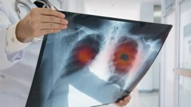

```{r setup, include=FALSE}
knitr::opts_chunk$set(echo = FALSE)
```



## Source of the article

https://www.bbc.com/news/uk-scotland-49638208 published on 10 September 2019.

Word count : 551

## Vocabulary

I used https://www.wordreference.com/, https://www.dictionary.cambridge.org/, https://www.lexico.com/ to fill in this table.


| Vocabulary       | Pronunciation       | Definition / synonym                                                            | French translation              |
| ---------------- | ------------------- | ------------------------------------------------------------------------------- | ------------------------------- |
| blood test       | [ˈblʌd ˈtɛst]       | analysis of a blood sample                                                      | analyse sanguine                |
| symptom          | [ˈsɪmptəm]          | sign of a disease                                                               | symptôme                        |
|  diagnose (with) | [ˈdaɪəgnəʊz]        | find the illness you have                                                       | diagnostiquer                   |
| undiagnosed      | [ʌnˈdʌɪəɡnəʊzd]     | not diagnosed yet                                                               | non diagnostiqué                |
| trial            | [ˈtraɪəl]           | clinical testing                                                                | essai, test                     |
| clinical         | [ˈklɪnɪkəl]         | refering to medical work related to the examination and treatment of ill people | clinique                        |
| recruit          | [rɪˈkruːt]          | seek for employment                                                             | recruter                        |
| former           | [ˈfɔːrmər]          | ~ that used to be                                                               | ex, ancien                      |
| Meanwhile        | [ˈmiːnhwaɪl]        | at the same time                                                                | pendant ce temps-là             |
| landmark         | [ˈlændmɑːrk]        | important                                                                       | important, majeur, capital      |
| significant      | [sɪgˈnɪfɪkənt]      | important                                                                       | significatif, important         |
| surgery          | [ˈs3ːrdʒəri]        | surgical intervention,  operation                                               | opération chirurgicale          |
| prospect (for)   | [prəˈspɛkt]         | seek , look for                                                                 | prospecter, chercher            |
|  roll out        | [ˈrəʊl ˈaʊt]        | introduce sth new to public                                                     | lancer                          |
| aim              | [ˈeɪm]              | objective, purpose                                                              | but, objectif                   |
| liver            | [ˈlɪvər]            | an organ that cleans the blood and produces bile                                | foie                            |
| ovarian          | [əʊˈvɛəriən]        | related to the ovaries                                                          | ovarien                         |
| in pursuit of    | [ˈɪn pərˈsjuːt ˈɒv] | seeking                                                                         | à la recherche de, en quête de  |
| oncology         | [ɒŋˈkɒlədʒɪ]        | study and treatment of cancer                                                   | oncologie                       |

## Analysis

|                               |                                                                                                                                                                                                 |
| ----------------------------- | ----------------------------------------------------------------------------------------------------------------------------------------------------------------------------------------------- |
| Researchers                   | Prof Frank Sullivan                                                                                                                                                                             |
| General topic                 | detection of lung cancer                                                                                                                                                                        |
| Published in                  | BBC, 10 September 2019 (presented a few days earlier in World Conference of Lung cancer in Barcelona)                                                                                           |
| Procedure / what was examined | trial on more than 12,000 people who were at risk (smokers and former smokers, between 50 and 75 years old) : blood test + CT scans (= computed tomography scans) + detection of autoantibodies |
| Conclusion / discovery        | detecting lung cancer at an early stage is possible : lower death rates and lower cost of treatment                                                                                             |
| Remaining questions           |                                                                                                                                                                                                 |
